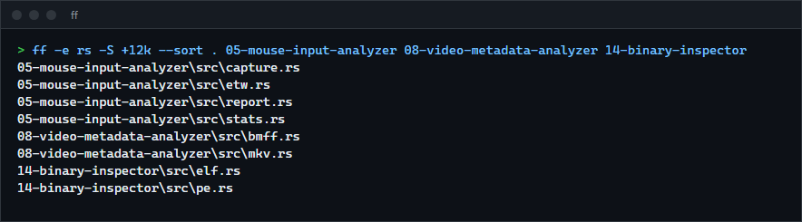

# Fast find

`ff` is a parallel file search tool: a regex on the file name plus filters for type, extension, size, age and permissions, skipping hidden files and anything `.gitignore` excludes. For people who use `find` or `fd` and want to see how they compare.

**Status:** v0.1.0, working. Benchmarked against `fd` and GNU `find` below.



## Features

- Parallel directory walk, with output buffered per thread so threads rarely contend on stdout.
- Filters compose: name or full-path regex, `-e` extension, `-t` type, `-S` size, `--newer` and `--older` age, `--readonly` and `--writable`.
- Smart case: a pattern without capitals matches case-insensitively.
- Respects `.gitignore`, `.ignore` and hidden files by default; `-H` and `-I` turn that off.
- Exit status for scripts: 0 found something, 1 found nothing, 2 error.

## How to install

Needs a Rust toolchain.

```sh
git clone https://github.com/r3clusionn/fast-find
cd fast-find
cargo install --path .
```

## How to use

The first argument is the pattern, the rest are directories. Use `.` as the pattern to match everything.

```sh
ff config                         # names containing "config", smart case
ff -e rs -S +10k src              # Rust files over 10 KiB under src
ff -t d --newer 2d . ~/projects   # directories modified in the last two days
ff -p 'src/.*_test\.rs$'          # regex on the whole path, always with forward slashes
ff -c -e log -H -I .              # count log files, including hidden and ignored ones
```

| Option | What it does |
|---|---|
| `-F` | Treat the pattern as a literal string. |
| `-i`, `-s` | Force case-insensitive or case-sensitive matching. |
| `-p` | Match the whole path instead of the name. |
| `-e EXT` | Extension, repeatable. Case-insensitive, no dot. |
| `-t f\|d\|l` | File, directory or symlink, repeatable. |
| `-S SIZE` | `+10M` at least, `-512k` at most, `4096` exactly. Units are 1024-based (`k`, `M`, `G`, `T`). |
| `--newer AGE`, `--older AGE` | Modified within, or at least this long ago: `30m`, `2h`, `7d`, `1w`. |
| `--readonly`, `--writable` | Filter on the read-only attribute. |
| `-H`, `-I` | Include hidden entries; ignore `.gitignore` rules. |
| `-L`, `-d N`, `-j N` | Follow symlinks, limit depth, set the thread count. |
| `-c`, `-0`, `--sort` | Count only, NUL-separated output, sorted output. |

## Benchmarks

Wall-clock time to list matches, all output sent to `NUL`. Windows 11, Intel Core i9-14900KF (24
threads), NVMe SSDs, warm filesystem cache. `ff` 0.1.0, `fd` 10.5.0, GNU `find` 4.10.0 from Git for
Windows. Each command ran once to warm up, then 7 times (5 on the larger tree); the table shows the
median. Hidden and ignore filtering are off for all three so they see the same files, and result
counts were checked equal between `ff` and `fd` before timing. Reproduce with `scripts/bench.ps1`.

`C:\Projects`, 155,408 entries:

| Search | ff | fd | GNU find |
|---|---|---|---|
| every entry | 95 ms | 83 ms | 1064 ms |
| extension `.rs` | 94 ms | 81 ms | 1087 ms |
| name contains `config` | 93 ms | 81 ms | 1107 ms |
| files over 10 MiB | 93 ms | 405 ms | not run |

`C:\Users\<profile>`, 766,841 entries:

| Search | ff | fd | GNU find |
|---|---|---|---|
| every entry | 522 ms | 434 ms | 5717 ms |
| extension `.rs` | 518 ms | 428 ms | 5758 ms |
| name contains `config` | 526 ms | 446 ms | 5877 ms |
| files over 10 MiB | 520 ms | 3655 ms | not run |

Reading the numbers: `fd` is about 15% faster than `ff` on name searches. `ff` is about 11 times
faster than GNU `find`, and 4 to 7 times faster than `fd` when a size filter is used. I did not
profile why `fd` is slow on the size filter. GNU `find -size` was not run because it stalled for
minutes on this machine. Linux and macOS were not measured.

## How it works

The walk uses the `ignore` crate's parallel walker, the same engine ripgrep uses. `ff` adds the
filter model (`src/lib.rs`, pure functions tested without a filesystem), per-thread output
buffering, and metadata fetching only when a size, age or permission filter needs it.

## Tests

`cargo test` runs 17 tests: filter logic with fake entries (sizes, durations, extensions, ages,
smart case), and the binary against a temporary tree with a `.gitignore`, hidden files, mixed
extensions and sizes.

## License

MIT (see `LICENSE`).
